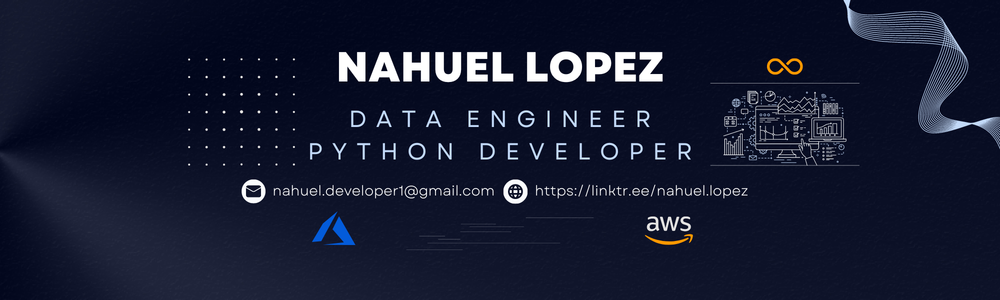

<section align="center">
  <!-- <h1><i>GitHub Profile</i></h1> -->
  
  
  <!-- 
<strong>{Open for hiring}</strong>
 -->
  

  

</section>

## 👨🏻‍💻 About me:

  
¡Hi, my name is <b><i>Nahuel</i></b> 👋🏽!!  

  
I work as a Data Engineer, but in my daily work, I handle both data engineering and data science as well as machine learning. 
   I am from Buenos Aires, Argentina, and I love the world of data, but I also enjoy development. I am currently studying Systems Engineering, and in my free time, I dedicate a significant portion of my time to learning new technologies, as well as practicing and strengthening my skills as a Data Engineer.

A few more things about me:

- 💡 I like to explore *`new technologies`, `solve problems` and `reading`.*
- 💪🏽 I enjoy going to the `gym` and doing `strength training`.
- 🌱 I’m currently mastering my skills in *`Data Engineering`*, *`Azure`*, *`Python`*, *`SQL`*, and *`Spark`*. 
- 🔭 I’m currently working on *`Data Engineering`*, *`Data Science`* and *`Backend Development`*. 

## 📊 GitHub Analytics:

<!-- blue-green, dark, great-gatsby -->

<!--
All inbuilt themes :-
dark, radical, merko, gruvbox, tokyonight, onedark, cobalt, synthwave, highcontrast, dracula, github_dark
-->

## ⚙️ I use daily: 

<!-- github_dark, highcontrast, great-gatsby -->

  

## 🛠 Tech Stack:

### Tools:

&nbsp;
&nbsp;
&nbsp;
\
&nbsp;
&nbsp;
&nbsp;
&nbsp;
&nbsp;

### Data Engineering:

&nbsp;
&nbsp;
&nbsp;
\
&nbsp;
&nbsp;
&nbsp;
\
&nbsp;
&nbsp;
&nbsp;

<!-- &nbsp; -->
<!-- &nbsp; -->
<!--  -->
<!--  -->

### Data Science & Machine Learning:

&nbsp;
&nbsp;
&nbsp;
&nbsp;
\
&nbsp;

<!-- &nbsp;
&nbsp; -->

### Databases:

&nbsp;
&nbsp;
&nbsp;
\
&nbsp;
&nbsp;

### Backend:

&nbsp;
&nbsp;
\
&nbsp;
&nbsp;
&nbsp;

<!-- &nbsp; -->

### Front-end:

&nbsp;
&nbsp;
\
&nbsp;
&nbsp;

## 📫 Connect with Me:

💬 Feel free to reach out to me

&nbsp;
&nbsp;
&nbsp;

**✔️ Check the Repositories and don't forget to give a star ⭐**

  
Developed with 💙 by <i><b>NaLo Dev ထ</b></i>

 
  <!--Contador de visitas-->
  

 

<!-- ---

****************** -->
