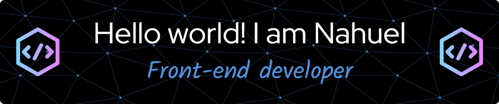

<!--
All inbuilt themes :-
dark, radical, merko, gruvbox, tokyonight, onedark, cobalt, synthwave, highcontrast, dracula, github_dark
-->

  

  

  
  

<!--
  <h1 align="center"> Hello world 👋, I'm Nahuel </h1>
  
(Open for Hiring)

-->

## 👨🏻‍💻 About me:

### *I'm from Buenos Aires (Argentina) and I am a front-end developer and math teacher, studying to be a full stack web developer.*

- 💡  I like to explore new technologies
- 🔭 I’m currently working on Web Development
- 🌱 I’m currently mastering my skills in Javascript  
- 👯 I’m looking to collaborate on Javascript projects

## ⚙️ GitHub Analytics

## ⚙️ I use daily: 

 

 

## 🛠 Tech Stack:

<!-- alternative: How to reach me -->
## 📫 Connect with Me:
💬 Feel free to reach out to me

## ✔️ Check the Repositories and don't forget to give a star ⬇️

:star: From [Nahuel-DevOne](https://github.com/Nahuel-DevOne)

  

 
  <!--Contador de visitas-->
  

 
***************************************************************
